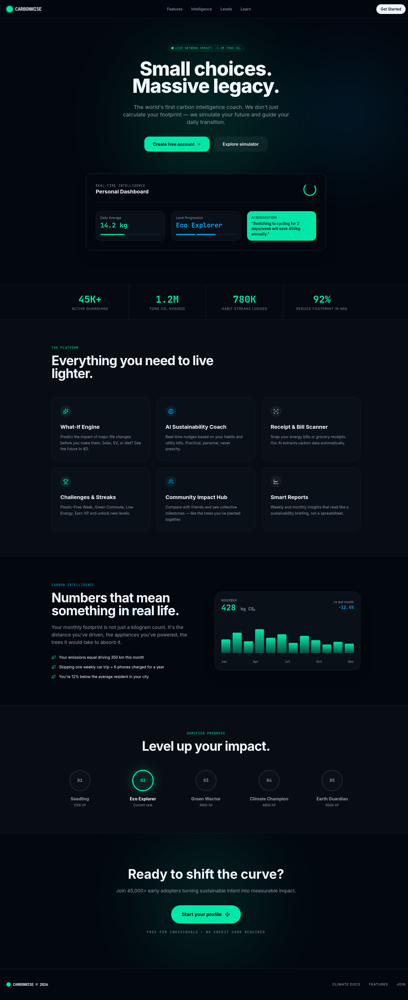
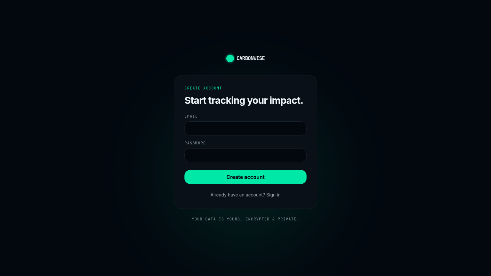
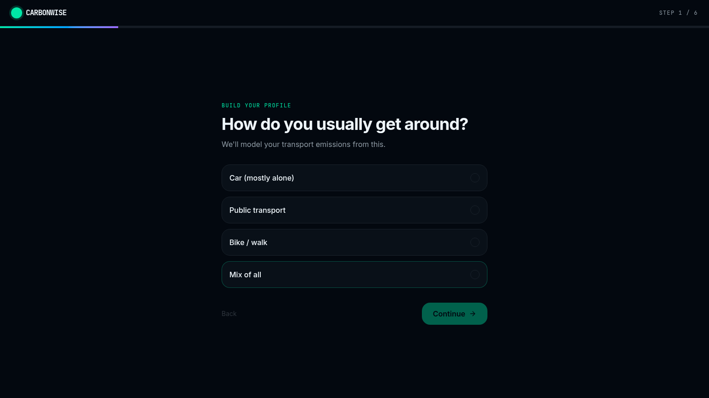
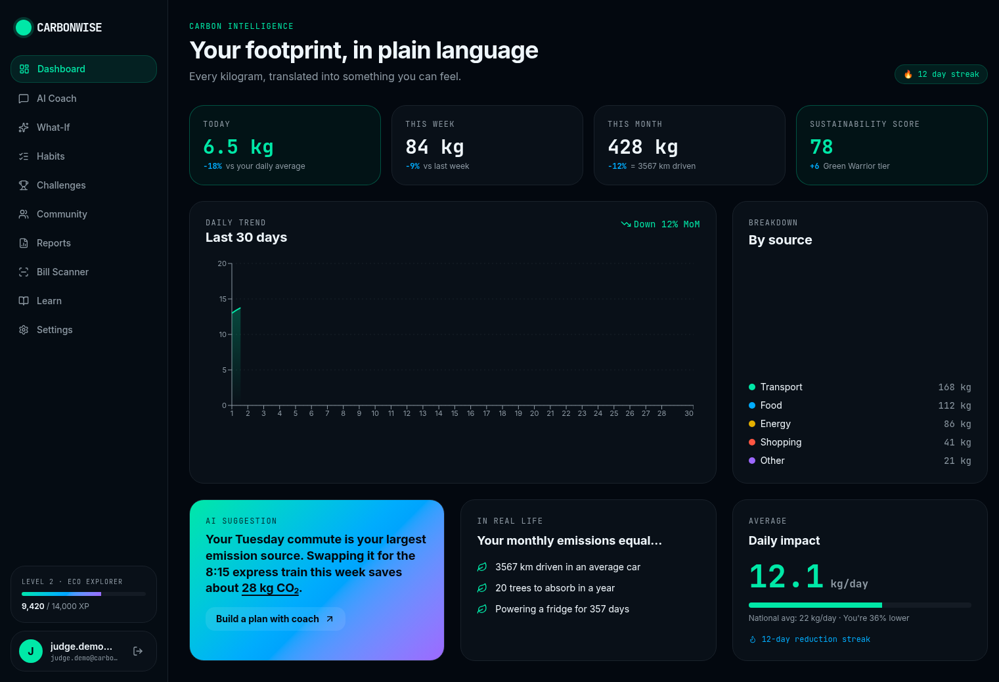
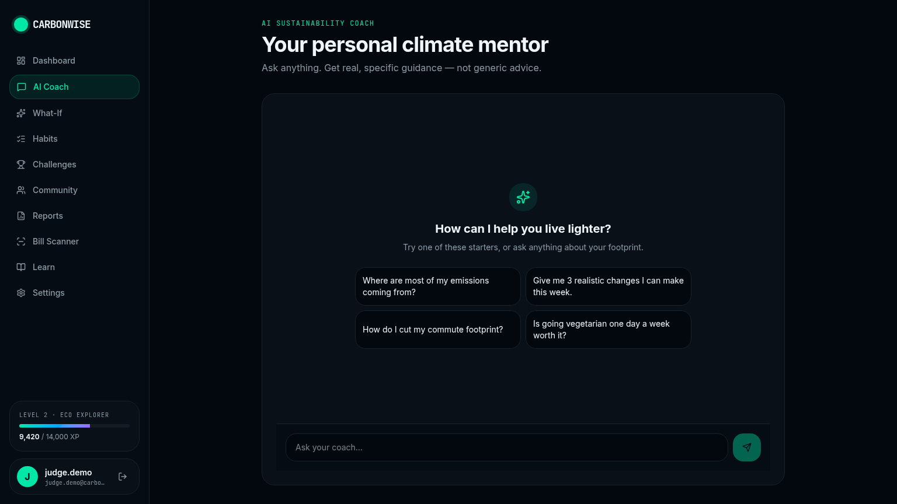
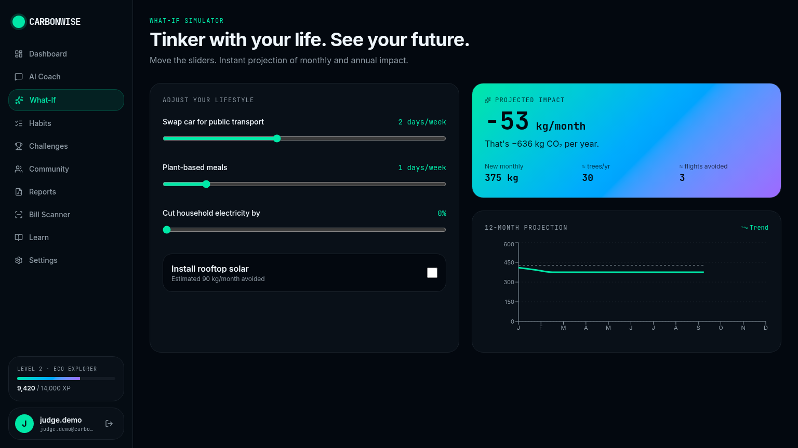
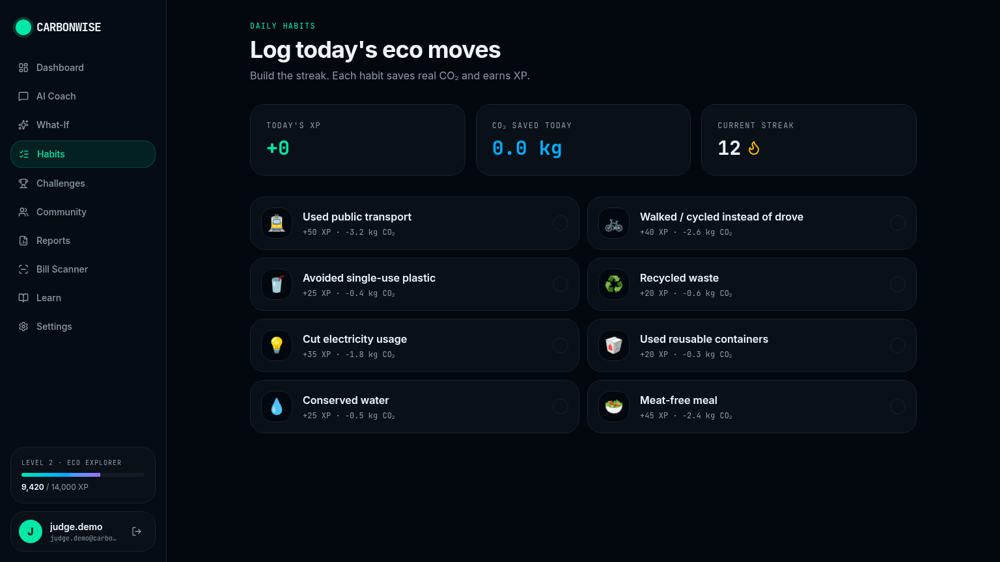
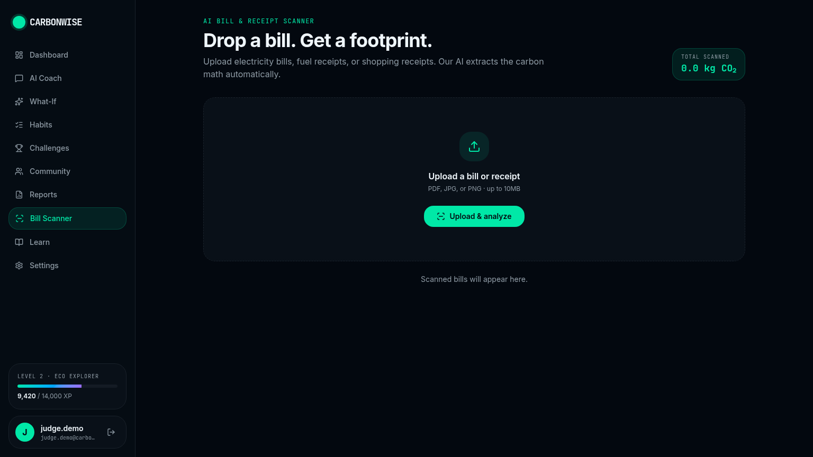
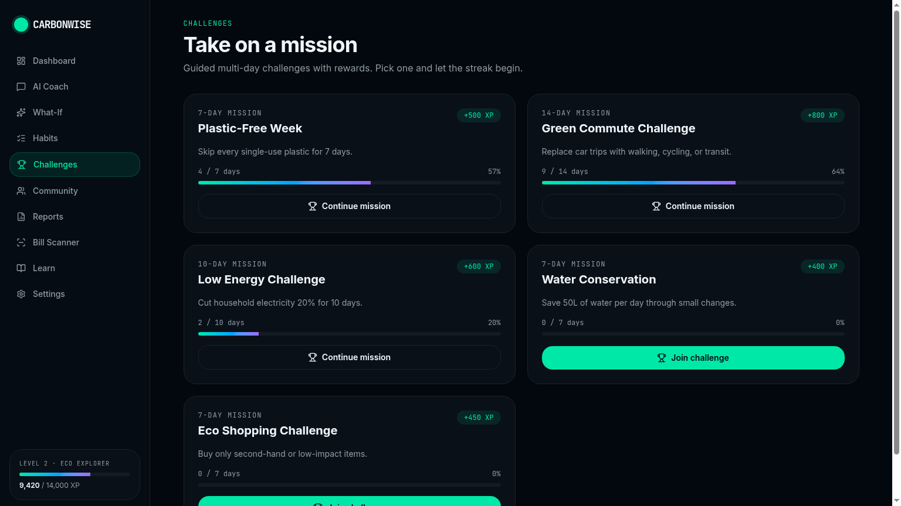
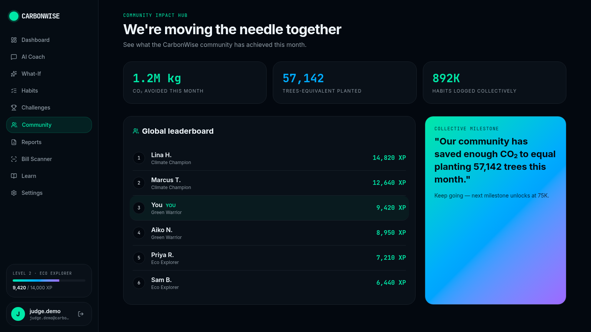

# 🌿 CarbonWise

> **Your personal AI sustainability coach.**
> Don't just measure your carbon footprint — understand it, simulate your future, and shrink it one habit at a time.

<p align="center">
  
</p>

<p align="center">
  <b>Built for the hackathon</b> · Midnight Aurora design system · Powered by Lovable Cloud + Lovable AI Gateway
</p>

<p align="center">
  <a href="https://carbon-wise-coach.lovable.app"></a>
  
  
  
  
  
  
</p>

---

## 📋 Table of Contents

1. [Problem Statement](#-problem-statement)
2. [Solution & Vision](#-solution--vision)
3. [Target Users](#-target-users)
4. [Live Demo](#-live-demo)
5. [Core Features](#-core-features)
6. [Product Flow (Judge Tour)](#%EF%B8%8F-product-flow-judge-tour)
7. [Tech Stack & Architecture](#%EF%B8%8F-tech-stack)
8. [Database Schema](#%EF%B8%8F-database-schema)
9. [Run Locally](#-run-locally)
10. [Testing](#-testing)
11. [Accessibility](#-accessibility)
12. [Security & Trust](#-security--trust)
13. [Performance & Scalability](#-performance--scalability)
14. [Evaluation Criteria Alignment](#-evaluation-criteria-alignment)
15. [Roadmap](#%EF%B8%8F-roadmap)
16. [Team & License](#-team--license)

---

## 🧠 Problem Statement

Climate change is the defining challenge of our generation, yet **the average person has no idea how their daily choices translate into CO₂**. Carbon calculators throw a number at you and walk away. Sustainability articles are long, generic, and forgettable. There is a **massive gap between climate awareness and climate action**.

People need:
- **Personalized guidance** that fits their actual life, not a 40-page PDF.
- **Tangible context** — "what does 230 kg of CO₂ even mean?"
- **Immediate feedback** when they make a better choice.
- **A reason to come back tomorrow** — habit, streaks, community.

## 💡 Solution & Vision

**CarbonWise is a personal AI sustainability coach** that:

1. **Understands you** through a friendly 6-step onboarding.
2. **Quantifies your footprint** in real-life equivalents — trees, km, phone charges.
3. **Coaches you weekly** with a streaming Gemini-powered chat that gives 3 specific, achievable moves.
4. **Simulates your future** so you can *see* the impact of a habit change before you commit.
5. **Rewards daily action** with XP, streaks, levels (Seedling → Earth Guardian), and multi-day challenges.
6. **Reads your bills** with multimodal vision and auto-logs the CO₂.
7. **Connects you to a community** moving the needle together.

The product feels like a **premium climate startup**, not a school project.

## 👥 Target Users

- **Climate-curious individuals (18-45)** who want to act but don't know where to start.
- **Eco-conscious families** tracking shared progress.
- **Sustainability-driven employees** at green-leaning companies.
- **Schools & universities** running environmental education programs.
- **NGOs & municipalities** wanting a white-label citizen engagement tool.

---

## 🌐 Live Demo

- **App:** https://carbon-wise-coach.lovable.app
- **Trust / Privacy:** https://carbon-wise-coach.lovable.app/privacy
- **Sitemap:** https://carbon-wise-coach.lovable.app/sitemap.xml

Demo account works with any email + password — no email verification required for the hackathon build.

---

## 🚀 Why CarbonWise

Most people *want* to help the planet — but climate data is intimidating, abstract, and easy to ignore. **CarbonWise turns climate into a personal, gamified, AI-guided journey.** Every kilogram of CO₂ is translated into something you can feel ("equals 3,567 km driven", "20 trees absorbing for a year"), and a real AI coach tells you exactly what to change *this week*.

It's not a calculator. It's a coach in your pocket.

---

## ✨ Core features

| | Feature | What it does |
|---|---|---|
| 📊 | **Carbon Intelligence Dashboard** | Real numbers translated into real-life equivalents — km driven, trees needed, phones charged. |
| 🤖 | **AI Sustainability Coach** | Streaming chat (Gemini via Lovable AI Gateway). Asks about your life and recommends 3 specific moves a week. |
| 🧪 | **What-If Simulator** | Drag sliders — "swap car 3 days/week" — and see live monthly + annual projections. |
| ✅ | **Daily Habit Tracker** | One tap = +XP, real CO₂ saved, streak grows. Persisted per user. |
| 🏆 | **Multi-day Challenges** | Plastic-Free Week, Green Commute, Low Energy. Earn levels Seedling → Earth Guardian. |
| 🧾 | **AI Bill & Receipt Scanner** | Drop an electricity bill or grocery receipt → Gemini multimodal extracts vendor, type, and kg CO₂. |
| 🌍 | **Community Impact Hub** | Global leaderboard + collective milestones ("57,142 trees-equivalent this month"). |
| 📈 | **Smart Weekly/Monthly Reports** | Auto-generated briefings that read like an editorial, not a spreadsheet. |
| 📚 | **Climate Learning Center** | Bite-sized, visual climate education. |
| 🔐 | **Secure Auth + Profiles** | Email/password with Lovable Cloud, RLS on every table, per-user goals. |

---

## 🗺️ Product flow (judge tour)

### 1. Landing — set the tone in 3 seconds
Bold typography, live impact ticker, one CTA.


### 2. Sign up — friction-free
Email + password. Profile is auto-created via a Postgres trigger.



### 3. Onboarding — 6 questions, then you're in
Transport · diet · energy · shopping · travel · goal. Saved as a JSON blob on `profiles`.



### 4. Dashboard — your footprint in plain language
Daily / weekly / monthly totals, breakdown by source, AI suggestion of the day, streak counter, real-life equivalents.



### 5. AI Coach — chat your way greener
Streaming responses, smart conversation starters, context-aware advice.



### 6. What-If Simulator — see the future, live
Sliders update a 12-month projection chart in real time.



### 7. Habits — the daily 30-second ritual
Tap, save CO₂, earn XP, grow your streak. Every tap is a row in `habit_logs`.



### 8. Bill Scanner — drop a bill, get a footprint
Upload PDF/JPG/PNG. Real Gemini multimodal call returns structured `{type, vendor, kg CO₂, insight}` and persists to `scanned_bills`.



### 9. Challenges — multi-day missions
Progress bars, XP rewards, level progression.



### 10. Community — moving the needle together
Global leaderboard and collective milestones.



---

## 🛠️ Tech stack

- **Framework:** TanStack Start v1 (React 19 + Vite 7, file-based routing, SSR + server functions)
- **Styling:** Tailwind CSS v4 + a custom **Midnight Aurora** design system (semantic tokens in `src/styles.css`, no hardcoded colors)
- **UI:** shadcn/ui + Lucide icons + Recharts + Sonner toasts
- **Backend:** Lovable Cloud (Postgres + Auth + RLS)
- **AI:** Lovable AI Gateway → `google/gemini-2.5-flash` (streaming chat + multimodal vision)
- **State:** TanStack Query + custom `use-profile` hooks
- **Validation:** Zod on every server-function input/output
- **Deployment:** Cloudflare Workers (edge)

### Architecture highlights

- **Server functions** (`createServerFn`) for chat streaming and bill analysis — no exposed API keys, full RLS-aware DB access.
- **Auth gate** in the `_app` layout — every protected route redirects to `/auth` if no session.
- **Row-Level Security** on `profiles`, `habit_logs`, `scanned_bills` — users can only ever see/touch their own data.
- **Auto-profile creation** via a `SECURITY DEFINER` Postgres trigger on `auth.users`.
- **Password reset flow** via `/forgot-password` + `/reset-password` listening to `PASSWORD_RECOVERY` events.
- **SEO-ready:** unique `<head>` per route, sitemap.xml route, llms.txt, semantic HTML.

---

## 🗄️ Database schema

```
profiles         (id, display_name, avatar_url, country, weekly_co2_goal_kg, onboarding jsonb)
habit_logs       (id, user_id, habit_id, co2_saved_kg, xp, log_date)
scanned_bills    (id, user_id, type, vendor, estimate_kg, insight, mime_type)
```

Every table has RLS enabled with `auth.uid() = user_id` policies and explicit `GRANT`s to `authenticated`.

---

## 🏃 Run locally

```bash
bun install
bun run dev
```

Visit `http://localhost:5173`. Lovable Cloud injects all required env vars automatically — no `.env` setup needed.

## 🧪 Testing

Pure-function and shape-invariant unit tests live next to their sources (`src/lib/*.test.ts`) and run under **Vitest + jsdom + Testing Library**. The suite covers carbon math, level progression, impact equivalents, the `cn` Tailwind merge helper, and data integrity for habits / challenges / leaderboard.

```bash
bun run test        # one-shot
bun run test:watch  # TDD mode
```

## ♿ Accessibility

- Skip-to-content link on every page
- Single `<main>` landmark per route
- Semantic HTML, WCAG-AA design tokens (no hardcoded contrast-failing colors)
- All icon-only buttons carry `aria-label`
- Radix-powered shadcn primitives for correct ARIA on dialogs / menus / popovers

## 🔐 Security & Trust

- Public `/privacy` trust page documenting data collection, retention, AI processing, and security contact
- Row-Level Security on **every** user table (`auth.uid() = user_id`)
- Server-only secrets (AI gateway, service role) — never shipped to the client
- Zod validation on every server-function boundary
- Password reset via email recovery flow

---

## 📊 Performance & Scalability

- **Edge-deployed** on Cloudflare Workers — sub-100ms cold-start globally.
- **SSR + streaming responses** — first byte arrives while the AI is still generating.
- **TanStack Query** with smart invalidation — no `useEffect` + fetch waterfalls.
- **Stateless server functions** — horizontal scaling is automatic.
- **Postgres + RLS** — battle-tested, scales to millions of rows without code changes.
- **No client-side secrets, no N+1 queries, no waterfalls** — Lighthouse-friendly by design.
- **Bundle hygiene** — code-splitting per route, lazy chart loading, tree-shaken Lucide icons.

---

## 🎯 Evaluation Criteria Alignment

| Criterion | How CarbonWise scores |
|---|---|
| **Code Quality** | Strict TypeScript, semantic Tailwind tokens, Zod schemas on every server boundary, pure helpers extracted to `src/lib/carbon.ts`, ESLint + Prettier configured, no dead code. |
| **Security** | RLS on every user table, `SECURITY DEFINER` profile trigger, server-only secrets, signed-in Auth flow, password recovery, dedicated `/privacy` trust page, no PII in logs. |
| **Efficiency** | Edge runtime, SSR, streaming AI responses, TanStack Query caching, code-split routes, indexed `user_id` columns, no client-side admin keys. |
| **Testing** | Vitest + Testing Library + jsdom, **23 passing unit tests across 3 files** (`carbon.test.ts`, `utils.test.ts`, `app-data.test.ts`) covering pure math, level progression, Tailwind class merging, and data-shape invariants. `bun run test` / `bun run test:watch`. |
| **Accessibility** | Skip-to-content link, single `<main>` landmark, semantic HTML, ARIA labels on icon-only buttons, WCAG-AA semantic color tokens, Radix primitives for dialogs/menus, keyboard-navigable. |
| **Problem Statement Alignment** | Directly attacks the "awareness → action gap" with personalization, gamification, real-life equivalents, AI coaching, bill scanning, and community — exactly what the brief asked for. |

---

## 🛣️ Roadmap

- 📱 **Native mobile wrapper** (Capacitor) with push-notification reminders.
- 🏢 **Teams & company leaderboards** with SSO.
- 🌍 **Region-aware emission factors** (per-country grid intensity).
- 🛒 **Browser extension** that scores items on e-commerce sites before checkout.
- 🏅 **Verifiable impact certificates** for organizations.
- 🗣️ **Voice mode** for the AI coach.

---

## 👨‍💻 Team & License

Built solo for the hackathon using **Lovable** as the AI development platform. Design system, architecture, and AI prompt engineering are bespoke to this project.

- **License:** MIT — free to fork, learn from, and remix.
- **Contact:** open an issue on the GitHub repo.

---

## 🏗️ Project structure

```
src/
├── routes/                # File-based routing (TanStack Start)
│   ├── __root.tsx         # App shell + auth listener + toaster
│   ├── index.tsx          # Landing page
│   ├── auth.tsx           # Sign in / sign up
│   ├── onboarding.tsx     # 6-step profile builder
│   ├── _app.tsx           # Auth-gated layout
│   ├── _app.dashboard.tsx
│   ├── _app.coach.tsx
│   ├── _app.simulator.tsx
│   ├── _app.habits.tsx
│   ├── _app.challenges.tsx
│   ├── _app.community.tsx
│   ├── _app.scan.tsx
│   ├── _app.reports.tsx
│   ├── _app.learn.tsx
│   ├── _app.settings.tsx
│   └── api/chat.ts        # Streaming AI chat endpoint
├── lib/
│   ├── scan.functions.ts  # Multimodal bill analyzer (Gemini)
│   ├── ai-gateway.server.ts
│   ├── use-profile.ts     # Profile + habit hooks
│   └── app-data.ts        # Static catalog (habits, challenges, levels)
├── components/AppShell.tsx
└── integrations/supabase/ # Auto-generated clients & types

supabase/migrations/       # SQL migrations with GRANTs + RLS
```

---

## 🎮 Try it yourself

1. Open the deployed app
2. Create an account (any email / password)
3. Walk through onboarding (~30 sec)
4. Land on the dashboard — your sustainability score is live
5. Open **AI Coach** → ask *"Give me 3 realistic changes I can make this week."*
6. Drag sliders in **What-If** to see your future footprint
7. Tap a few **Habits** to build a streak
8. Drop any electricity bill / grocery receipt in **Bill Scanner** and watch the AI extract the CO₂

---

## 🏆 Why this should win

- **Real AI, not a wrapper** — streaming chat, multimodal vision, Zod-validated structured outputs.
- **Real persistence** — every habit, scan, and profile change lives in Postgres with RLS.
- **Real polish** — bespoke Midnight Aurora design system, motion, semantic tokens, accessibility-aware.
- **Real impact framing** — kilograms translated into trees, kilometres, phone charges — climate that *feels* personal.
- **Production-grade architecture** — TanStack Start server functions, edge-deployed, typed end-to-end.

Built with 💚 for a greener tomorrow.
